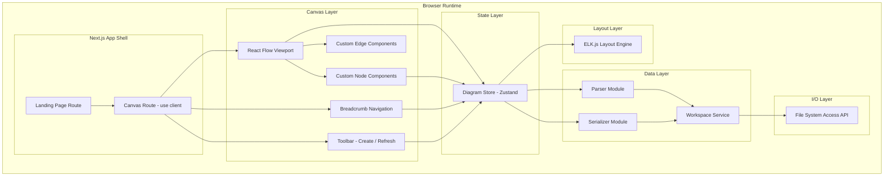

# Design Document: C4 Diagramming Platform

## Overview

The C4 Diagramming Platform is a local-first, browser-based application that renders interactive C4 architecture diagrams from Markdown files with YAML frontmatter. The platform operates entirely client-side, reading and writing architecture files from the user's local file system via the File System Access API. It uses React Flow for infinite canvas rendering, ELK.js for automated layout computation, gray-matter for frontmatter parsing/serialization, and Zustand for transient state management — all within a Next.js App Router shell.

### Key Design Decisions

1. **Local-first architecture**: All data stays on the user's machine. No server, no database, no cloud sync. The File System Access API (`window.showDirectoryPicker`) provides direct read/write access to a local workspace directory. This limits browser support to Chromium-based browsers (Chrome, Edge, Arc, Brave).

2. **Markdown-as-source-of-truth**: Each C4 element is a single `.md` file with YAML frontmatter for structural data and a Markdown body for documentation. This makes architecture definitions version-controllable and human-readable.

3. **Transient state only**: The Zustand store holds the current diagram state (nodes, edges, viewport, active C4 level) in memory. There is no persistence layer beyond the file system itself. Refreshing the browser reloads from disk.

4. **Client-side rendering isolation**: The canvas route uses `"use client"` to avoid SSR conflicts with React Flow and the File System Access API, which are browser-only APIs.

5. **Automated layout over manual positioning**: Node positions are computed by ELK.js on every render cycle rather than stored in files. This keeps architecture files clean and ensures consistent layouts.

## Architecture

The application follows a layered architecture with clear separation between file I/O, data transformation, state management, and rendering.



### Data Flow

1. **Open Workspace**: User selects a directory → `WorkspaceService` stores the `FileSystemDirectoryHandle` → scans for `.md` files → `Parser` extracts frontmatter → `DiagramStore` receives parsed elements → `LayoutEngine` computes positions → React Flow renders nodes and edges.

2. **Drill Down**: User double-clicks a node → `DiagramStore` pushes current level to navigation stack → filters children of activated node → `LayoutEngine` recomputes layout → React Flow re-renders at new level.

3. **Edit & Save**: User modifies element via UI → `DiagramStore` updates transient state → `Serializer` writes updated frontmatter back to the corresponding `.md` file via `WorkspaceService`.

4. **Refresh**: User clicks refresh → `WorkspaceService` re-reads all `.md` files → `Parser` re-extracts data → `DiagramStore` diffs and updates → `LayoutEngine` recomputes → React Flow re-renders, preserving viewport.

## Components and Interfaces

### 1. WorkspaceService

Manages the File System Access API lifecycle and file I/O operations.

```typescript
interface WorkspaceService {
  /** Opens a directory picker and stores the handle */
  openWorkspace(): Promise<FileSystemDirectoryHandle>;

  /** Scans the workspace for all .md files, returns file entries */
  scanFiles(handle: FileSystemDirectoryHandle): Promise<WorkspaceFileEntry[]>;

  /** Reads the text content of a single file */
  readFile(handle: FileSystemDirectoryHandle, fileName: string): Promise<string>;

  /** Writes text content to a file, creating it if it doesn't exist */
  writeFile(handle: FileSystemDirectoryHandle, fileName: string, content: string): Promise<void>;

  /** Checks if the File System Access API is supported */
  isSupported(): boolean;
}

interface WorkspaceFileEntry {
  name: string;
  handle: FileSystemFileHandle;
}
```

### 2. Parser Module

Extracts and validates YAML frontmatter from architecture files using gray-matter.

```typescript
interface ParseResult {
  success: true;
  element: ArchitectureElement;
  body: string;
}

interface ParseError {
  success: false;
  filePath: string;
  error: string;
}

type ParseOutcome = ParseResult | ParseError;

interface ParserModule {
  /** Parses a raw file string into structured data */
  parseFile(content: string, filePath: string): ParseOutcome;

  /** Validates frontmatter fields against the schema */
  validateFrontmatter(data: Record<string, unknown>): ValidationResult;
}

interface ValidationResult {
  valid: boolean;
  errors: string[];
}
```

### 3. Serializer Module

Converts structured data back into Markdown files with YAML frontmatter.

```typescript
interface SerializerModule {
  /** Serializes an element and body content into a full Markdown string */
  serialize(element: ArchitectureElement, body: string): string;

  /** Generates a unique ID for new elements */
  generateId(): string;
}
```

### 4. Layout Engine

Wraps ELK.js to compute node positions and edge routes.

```typescript
interface LayoutInput {
  nodes: LayoutNode[];
  edges: LayoutEdge[];
  boundaryGroups: BoundaryGroup[];
}

interface LayoutNode {
  id: string;
  width: number;
  height: number;
  parentId?: string; // for boundary group membership
}

interface LayoutEdge {
  id: string;
  source: string;
  target: string;
}

interface BoundaryGroup {
  id: string;
  label: string;
  childIds: string[];
}

interface LayoutResult {
  nodes: Array<{ id: string; x: number; y: number }>;
  edges: Array<{ id: string; sections: EdgeSection[] }>;
}

interface EdgeSection {
  startPoint: { x: number; y: number };
  endPoint: { x: number; y: number };
  bendPoints?: Array<{ x: number; y: number }>;
}

interface LayoutEngine {
  /** Computes positions for all nodes and edge routes */
  computeLayout(input: LayoutInput): Promise<LayoutResult>;
}
```

**ELK.js Configuration**:
- Algorithm: `layered` (best for directed dependency graphs)
- Edge routing: `ORTHOGONAL` (right-angled paths per requirements)
- Hierarchy handling: `INCLUDE_CHILDREN` (for boundary group support)
- Node spacing: `50` (horizontal), `50` (vertical)
- Layer spacing: `80`

### 5. Diagram Store (Zustand)

Central state management for the canvas.

```typescript
interface NavigationEntry {
  level: C4Level;
  parentId: string | null;
  label: string;
}

interface DiagramState {
  // Workspace
  directoryHandle: FileSystemDirectoryHandle | null;
  workspaceName: string | null;
  allElements: ArchitectureElement[];
  parseErrors: ParseError[];

  // Canvas
  nodes: ReactFlowNode[];
  edges: ReactFlowEdge[];
  activeLevel: C4Level;
  navigationStack: NavigationEntry[];

  // Viewport
  viewport: { x: number; y: number; zoom: number };
}

interface DiagramActions {
  // Workspace actions
  setWorkspace(handle: FileSystemDirectoryHandle, name: string): void;
  setElements(elements: ArchitectureElement[], errors: ParseError[]): void;

  // Navigation actions
  drillDown(nodeId: string): void;
  navigateToBreadcrumb(index: number): void;

  // Element CRUD
  addElement(element: ArchitectureElement): void;
  updateElement(id: string, updates: Partial<ArchitectureElement>): void;
  removeElement(id: string): void;

  // Canvas state
  setNodes(nodes: ReactFlowNode[]): void;
  setEdges(edges: ReactFlowEdge[]): void;
  setViewport(viewport: { x: number; y: number; zoom: number }): void;

  // Refresh
  refreshWorkspace(): Promise<void>;
}
```

**Selector pattern**: Each component subscribes to the minimal state slice it needs via Zustand selectors to prevent unnecessary re-renders.

```typescript
// Example selectors
const useNodes = () => useDiagramStore((s) => s.nodes);
const useActiveLevel = () => useDiagramStore((s) => s.activeLevel);
const useNavigationStack = () => useDiagramStore((s) => s.navigationStack);
```

### 6. Custom Node Components

Four distinct React components registered as React Flow custom node types.

```typescript
// Node type registry passed to <ReactFlow nodeTypes={...} />
const nodeTypes = {
  system: SystemNode,
  container: ContainerNode,
  component: ComponentNode,
  code: CodeNode,
  boundary: BoundaryGroupNode,
};
```

Each node component receives element data via React Flow's `data` prop:

```typescript
interface C4NodeData {
  name: string;
  description: string;
  technology?: string;
  c4Type: C4Type;
  hasChildren: boolean;
  onDrillDown: (nodeId: string) => void;
}
```

**Visual differentiation**:
- **SystemNode**: Rounded rectangle, blue-toned background, person/system icon
- **ContainerNode**: Rectangle with dashed border, green-toned background, container icon
- **ComponentNode**: Rectangle with solid border, purple-toned background, component icon
- **CodeNode**: Rectangle with monospace font, gray-toned background, code icon
- **BoundaryGroupNode**: Dashed border container with label header, transparent background

### 7. Canvas Route Component

The main canvas page, wrapped in `"use client"`.

```typescript
// app/canvas/page.tsx
"use client";

interface CanvasPageProps {}

// Composes:
// - ReactFlowProvider wrapping ReactFlow viewport
// - Toolbar panel (Open Workspace, Create Element, Refresh)
// - Breadcrumb navigation bar
// - Empty state overlay
// - Loading indicator
// - Error boundary for File System Access API support
```

### 8. Breadcrumb Navigation

Displays the drill-down path and allows backward navigation.

```typescript
interface BreadcrumbProps {
  stack: NavigationEntry[];
  onNavigate: (index: number) => void;
}
```

### 9. Element Creation Form

Modal/panel for creating new architecture elements.

```typescript
interface CreateElementFormData {
  name: string;
  type: C4Type;
  description: string;
  technology?: string;
  parentId?: string;
}

interface CreateElementFormProps {
  onSubmit: (data: CreateElementFormData) => Promise<void>;
  onCancel: () => void;
  currentLevel: C4Level;
  parentId?: string;
}
```

## Data Models

### Architecture Element

The core data structure representing a single C4 element parsed from an architecture file.

```typescript
type C4Type = 'system' | 'container' | 'component' | 'code';
type C4Level = 'L1' | 'L2' | 'L3' | 'L4';

interface Relationship {
  targetId: string;
  label?: string;
  technology?: string;
}

interface ArchitectureElement {
  id: string;
  type: C4Type;
  name: string;
  description: string;
  technology?: string;
  parentId?: string;
  boundary?: string;
  relationships: Relationship[];
}
```

### Architecture File Format

Each `.md` file follows this structure:

```markdown
---
id: "payment-service"
type: "container"
name: "Payment Service"
description: "Handles payment processing and billing"
technology: "Node.js / Express"
parentId: "ecommerce-system"
boundary: "internal-services"
relationships:
  - targetId: "database"
    label: "Reads/writes"
    technology: "PostgreSQL"
  - targetId: "stripe-api"
    label: "Processes payments"
    technology: "HTTPS/REST"
---

# Payment Service

Detailed documentation about the payment service goes here.
This Markdown body is preserved during serialization round-trips.
```

### C4 Type to Level Mapping

| C4 Type     | C4 Level | Description                        |
|-------------|----------|------------------------------------|
| `system`    | L1       | System Context — top-level systems |
| `container` | L2       | Containers within a system         |
| `component` | L3       | Components within a container      |
| `code`      | L4       | Code units within a component      |

### React Flow Node Structure

```typescript
interface ReactFlowNode {
  id: string;
  type: 'system' | 'container' | 'component' | 'code' | 'boundary';
  position: { x: number; y: number };
  data: C4NodeData;
  parentId?: string; // for boundary group nesting
  extent?: 'parent';
  style?: React.CSSProperties;
}
```

### React Flow Edge Structure

```typescript
interface ReactFlowEdge {
  id: string;
  source: string;
  target: string;
  type: 'smoothstep'; // orthogonal routing
  label?: string;
  data?: {
    technology?: string;
    hasWarning?: boolean; // for missing target references
  };
  animated?: boolean;
  style?: React.CSSProperties;
}
```

### ELK Graph Input Structure

The layout engine transforms the internal model into ELK's expected format:

```typescript
interface ElkGraph {
  id: string;
  layoutOptions: Record<string, string>;
  children: ElkNode[];
  edges: ElkEdge[];
}

interface ElkNode {
  id: string;
  width: number;
  height: number;
  children?: ElkNode[]; // for boundary groups
  layoutOptions?: Record<string, string>;
}

interface ElkEdge {
  id: string;
  sources: string[];
  targets: string[];
}
```


## Correctness Properties

*A property is a characteristic or behavior that should hold true across all valid executions of a system — essentially, a formal statement about what the system should do. Properties serve as the bridge between human-readable specifications and machine-verifiable correctness guarantees.*

### Property 1: Parse-Serialize Round-Trip

*For any* valid `ArchitectureElement` and any Markdown body string, serializing the element and body into a Markdown string and then parsing that string back should produce an equivalent `ArchitectureElement` and identical body content. Conversely, for any valid Architecture_File string, parsing then serializing then parsing should produce an equivalent data structure.

**Validates: Requirements 2.6, 3.2, 3.5, 9.1**

### Property 2: Serialization Idempotence

*For any* valid `ArchitectureElement` and body content, serializing the element twice should produce byte-identical output strings, with consistent field ordering and indentation.

**Validates: Requirements 3.3**

### Property 3: Workspace File Scanning Filters

*For any* set of file entries in a directory containing a mix of `.md`, `.txt`, `.yaml`, and other extensions, the workspace scanner should return exactly the entries with the `.md` extension and no others.

**Validates: Requirements 1.5**

### Property 4: Frontmatter Required Field Validation

*For any* frontmatter object where one or more of the required fields (`id`, `type`, `name`, `description`) are missing, the parser's validation should return `valid: false` and the `errors` array should identify each missing field by name.

**Validates: Requirements 2.2**

### Property 5: Invalid C4 Type Rejection

*For any* string that is not one of `system`, `container`, `component`, or `code`, when used as the `type` field in frontmatter, the parser should return a validation error that contains both the invalid type value and the list of accepted values.

**Validates: Requirements 2.5**

### Property 6: Initial Render Level Filtering

*For any* set of `ArchitectureElement` objects with mixed C4 types, when the diagram is initialized at L1, the resulting node set should contain exactly the elements where `type === 'system'` and no elements of other types.

**Validates: Requirements 4.1**

### Property 7: Non-Overlapping Layout

*For any* set of nodes with positive width and height, after the layout engine computes positions, no two node bounding boxes should overlap (i.e., for every pair of nodes, their axis-aligned bounding rectangles should have zero intersection area).

**Validates: Requirements 5.1, 5.5**

### Property 8: Boundary Group Containment

*For any* node that belongs to a boundary group, after layout computation, the node's bounding box should be fully contained within the boundary group's bounding box.

**Validates: Requirements 5.3**

### Property 9: Drill-Down Shows Only Children at Next Level

*For any* element hierarchy and any parent node that has children, when a drill-down is performed on that parent, the resulting node set should contain exactly the direct children of that parent at the next C4 level, and the active level should advance by one (L1→L2, L2→L3, L3→L4).

**Validates: Requirements 6.1, 8.2**

### Property 10: Breadcrumb Navigation Consistency

*For any* sequence of drill-down operations through a valid element hierarchy, the breadcrumb trail should have one entry per level visited (including the root). When navigating back to any breadcrumb entry at index `i`, the rendered nodes should match the nodes that were visible at that level, and the active level should match the breadcrumb entry's level.

**Validates: Requirements 6.5, 6.6, 8.3**

### Property 11: hasChildren Flag Correctness

*For any* set of `ArchitectureElement` objects, an element's `hasChildren` flag should be `true` if and only if there exists at least one other element in the set whose `parentId` equals that element's `id`.

**Validates: Requirements 6.7**

### Property 12: Node Content Completeness

*For any* `ArchitectureElement` with a non-empty `name`, `description`, and `technology` field, the rendered node component's output should contain all three values as visible text.

**Validates: Requirements 7.5**

### Property 13: Store CRUD Reactivity

*For any* sequence of add, update, and remove operations on nodes and edges, after each operation the store's state should reflect the operation: added items should be present, updated items should have new values, and removed items should be absent.

**Validates: Requirements 8.5**

### Property 14: Edge Creation from Relationships

*For any* set of `ArchitectureElement` objects where element A has a relationship targeting element B's `id`, and both A and B are in the current view, there should exist an edge in the rendered diagram connecting A to B.

**Validates: Requirements 9.2**

### Property 15: Edge Data Completeness

*For any* relationship that includes a `label` field, the corresponding edge should carry that label. For any relationship that includes a `technology` field, the corresponding edge should carry that technology value.

**Validates: Requirements 9.3, 9.4**

### Property 16: Dangling Reference Warning

*For any* relationship where the `targetId` does not match any element's `id` in the current workspace, the corresponding edge should be marked with a warning indicator (`hasWarning: true`).

**Validates: Requirements 9.5**

### Property 17: Viewport Preservation During Refresh

*For any* viewport state (position x, y and zoom level), after a refresh operation completes, the viewport state should be identical to the pre-refresh state.

**Validates: Requirements 10.5**

### Property 18: Generated ID Uniqueness

*For any* sequence of N calls to `generateId()`, all N returned values should be distinct.

**Validates: Requirements 11.3**

### Property 19: Form Validation Identifies Missing Fields

*For any* element creation form submission where one or more of the required fields (`name`, `type`, `description`) are missing or empty, the validation result should identify each missing field by name.

**Validates: Requirements 11.5**

## Error Handling

### File System Errors

| Error Scenario | Handling Strategy |
|---|---|
| Browser doesn't support File System Access API | Display error message with browser recommendation (Chrome, Edge). Check `'showDirectoryPicker' in window` on mount. |
| User cancels directory picker | Catch `AbortError` from `showDirectoryPicker()`, silently ignore, keep current state. |
| File read fails during workspace scan | Log error with file path, skip the file, continue scanning remaining files. Add to `parseErrors` in store. |
| File write fails during save | Display toast notification (Sonner) with file name and error reason. Do not modify store state — keep the in-memory version so the user can retry. |
| Permission denied on file access | Display toast notification explaining the permission issue. Prompt user to re-open the workspace to re-grant permissions. |

### Parsing Errors

| Error Scenario | Handling Strategy |
|---|---|
| Malformed YAML frontmatter | Return `ParseError` with file path and gray-matter's error message. Skip element, continue parsing other files. |
| Missing required fields | Return `ParseError` listing the missing field names. Skip element. |
| Unrecognized `type` value | Return `ParseError` with the invalid type and the list of accepted values: `system`, `container`, `component`, `code`. |
| Missing `---` delimiters | gray-matter returns empty frontmatter. Validation catches missing required fields. |

### Navigation Errors

| Error Scenario | Handling Strategy |
|---|---|
| Drill-down on node with no children | Node's `hasChildren` flag is `false`. Drill-down action is disabled (no click handler). Visual indicator (muted style, no expand icon) communicates this to the user. |
| Breadcrumb navigation to invalid index | Guard with bounds check. If index is out of range, navigate to root (L1). |
| Relationship references non-existent target | Render edge with `hasWarning: true` flag. Edge displays a visual warning indicator (dashed line, warning color). Log validation message to console. |

### Layout Errors

| Error Scenario | Handling Strategy |
|---|---|
| ELK.js layout computation fails | Catch the error, log it, fall back to a simple grid layout (evenly spaced positions). Display a toast notification that auto-layout failed. |
| Layout takes longer than 5 seconds | Use a timeout wrapper around `elk.layout()`. If exceeded, cancel and fall back to grid layout. |

## Testing Strategy

### Testing Framework

- **Test Runner**: Vitest (aligned with Next.js/Vite ecosystem)
- **Property-Based Testing**: [fast-check](https://github.com/dubzzz/fast-check) — the standard PBT library for TypeScript/JavaScript
- **Component Testing**: React Testing Library for custom node components
- **Minimum PBT iterations**: 100 per property test

### Property-Based Tests

Each correctness property maps to a single `fast-check` property test. Tests are tagged with the property reference for traceability.

| Property | Test Description | Generator Strategy |
|---|---|---|
| Property 1 | Round-trip parse↔serialize | Generate random `ArchitectureElement` objects with random body strings. Use `fc.record()` for elements, `fc.string()` for body. |
| Property 2 | Serialization idempotence | Generate random elements, serialize twice, assert byte equality. |
| Property 3 | File scanning filters | Generate arrays of `{ name: string }` with random extensions including `.md`. |
| Property 4 | Required field validation | Generate frontmatter records with random subsets of required fields removed. |
| Property 5 | Invalid type rejection | Generate random strings excluding the 4 valid types via `fc.string().filter()`. |
| Property 6 | L1 filtering | Generate mixed-type element arrays, filter to systems, compare. |
| Property 7 | Non-overlapping layout | Generate node arrays with random widths/heights (20–300px), run ELK layout, check all pairs for overlap. |
| Property 8 | Boundary containment | Generate hierarchical node structures with boundary groups, run layout, verify containment. |
| Property 9 | Drill-down children | Generate element trees with parent-child relationships, drill down, verify child set. |
| Property 10 | Breadcrumb navigation | Generate drill-down sequences, navigate back to random indices, verify state. |
| Property 11 | hasChildren flag | Generate element sets with random parentId references, verify flag. |
| Property 12 | Node content | Generate elements with random name/description/technology, render, check text presence. |
| Property 13 | Store CRUD | Generate random sequences of add/update/remove operations, verify store state after each. |
| Property 14 | Edge creation | Generate element sets with inter-element relationships, verify edge existence. |
| Property 15 | Edge data | Generate relationships with random label/technology, verify edge carries them. |
| Property 16 | Dangling references | Generate element sets with some relationships pointing to non-existent IDs, verify warnings. |
| Property 17 | Viewport preservation | Generate random viewport states, trigger refresh, verify unchanged. |
| Property 18 | ID uniqueness | Generate N calls to generateId(), verify all distinct. |
| Property 19 | Form validation | Generate form data with random missing fields, verify error messages. |

### Unit Tests (Example-Based)

- **Type mapping**: Verify each of the 4 valid C4 types maps to the correct level (2.4)
- **Node type registry**: Verify `nodeTypes` object maps each type to its component (7.1–7.4)
- **Empty state**: Render canvas with no nodes, verify empty state message (4.6)
- **Edge type**: Verify edges use `smoothstep` type for orthogonal routing (4.5)
- **Landing page**: Verify landing page renders with navigation link to canvas (12.2)
- **Loading state**: Verify loading indicator shows before initialization (12.4)
- **Performance**: Layout 50 nodes completes under 2 seconds (5.6)
- **Refresh additions/deletions/modifications**: Verify each scenario with mocked file system (10.2, 10.3, 10.4)

### Edge Case Tests

- **Malformed YAML**: Various malformed YAML strings produce descriptive errors (2.3)
- **Browser API unsupported**: `showDirectoryPicker` undefined triggers error message (1.3)
- **User cancels picker**: `AbortError` is silently caught (1.4)
- **Write failure**: Mocked write error triggers notification with file name (3.4)

### Integration Tests

- **Full workspace load**: Open mock workspace → parse files → compute layout → render nodes
- **Create element flow**: Fill form → serialize → write → node appears on canvas
- **Drill-down and back**: Load workspace → drill into system → drill into container → breadcrumb back to L1

### Smoke Tests

- **React Flow configuration**: Verify `panOnDrag` and `zoomOnScroll` are enabled (4.3, 4.4)
- **Store shape**: Verify initial store state has all required fields (8.1)
- **Client directive**: Verify canvas route file contains `"use client"` (12.1)
- **App Router structure**: Verify route files exist in `app/` directory (12.3)
- **Selector existence**: Verify Zustand selector functions are exported (8.4)
