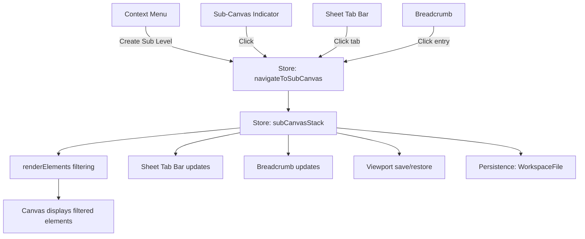

# Design Document: Multi-Sheet Sub-Canvas

## Overview

This feature introduces a multi-sheet/sub-canvas system to the C4 diagramming platform, allowing any node to act as a container for child elements displayed on a dedicated sheet. Unlike the existing C4-level drill-down (which is tied to the L1→L2→L3→L4 type hierarchy), sub-canvases are free-form: a parent node of any supported type can contain child elements of any type.

The design reuses the existing `parentId` field on `ArchitectureElement` for data modeling, so no schema changes are needed for the `.c4.json` file format. Navigation is handled through a new sub-canvas navigation system that operates independently of the C4 `activeLevel`, with a sheet tab bar at the bottom of the canvas and synchronized breadcrumb updates.

### Key Design Decisions

1. **Independent of C4 levels**: Sub-canvas navigation does not change `activeLevel`. The existing C4 drill-down and the new sub-canvas system coexist but operate on separate axes.
2. **Reuse `parentId`**: Child elements reference their parent via the existing `parentId` field. No new data model fields are needed for the parent-child relationship.
3. **Per-sheet viewport**: Each sheet stores its own viewport (pan/zoom) so users return to the same camera position when switching sheets.
4. **Single file persistence**: All sub-canvas data lives in the same `.c4.json` file, using the existing `WorkspaceFile` structure with a new `sheetViewports` map.

## Architecture

The feature touches four layers of the application:



### Component Interaction Flow

1. **Entry points**: Context menu "Create Sub Level", sub-canvas indicator click, sheet tab click, breadcrumb click
2. **State management**: New `subCanvasStack` in the Zustand store tracks the navigation path, separate from the existing `navigationStack` used by C4 drill-down
3. **Element filtering**: `renderElements` uses the top of `subCanvasStack` to determine which `parentId` to filter by
4. **Persistence**: `subCanvasStack` and per-sheet viewports are saved in `WorkspaceFile`

## Components and Interfaces

### 1. Store Extensions (`diagram-store.ts`)

New state fields:

```typescript
/** A sub-canvas navigation entry */
export interface SubCanvasEntry {
  parentId: string;   // The node whose children are displayed
  label: string;      // Display name for tabs and breadcrumbs
}

// New state fields on DiagramState
subCanvasStack: SubCanvasEntry[];
sheetViewports: Record<string, { x: number; y: number; zoom: number }>;
```

New actions:

```typescript
// New actions on DiagramActions
navigateToSubCanvas(nodeId: string): void;
navigateToSheet(index: number): void;    // -1 = root, 0+ = subCanvasStack index
navigateToRoot(): void;
```

**`navigateToSubCanvas(nodeId)`**: Saves the current viewport for the active sheet, pushes a new `SubCanvasEntry` onto `subCanvasStack`, and triggers re-render with the new parent filter.

**`navigateToSheet(index)`**: Saves the current viewport, truncates `subCanvasStack` to the given index (or clears it for root), restores the target sheet's viewport.

**`navigateToRoot()`**: Shortcut for `navigateToSheet(-1)`.

### 2. Context Menu Extension (`NodeContextMenu.tsx`)

Add a new prop and menu item:

```typescript
interface NodeContextMenuProps {
  // ... existing props
  onCreateSubLevel?: (nodeId: string) => void;
}
```

The "Create Sub Level" option appears for node types: `system`, `container`, `component`, `code`, `simple`. It is hidden for `text` and `group` nodes.

When clicked, it calls `onCreateSubLevel(nodeId)` which delegates to `store.navigateToSubCanvas(nodeId)`.

### 3. Sub-Canvas Indicator (Node Components)

Each node component that supports sub-canvases (`SystemNode`, `ContainerNode`, `ComponentNode`, `CodeNode`, `SimpleNode`) renders a small icon when `data.hasChildren` is `true`. The existing `hasChildren` flag computed in `elementsToNodes` already checks if any element has `parentId === node.id`.

The indicator is a clickable icon (e.g., a layers/stack icon) positioned at the bottom-right of the node. Clicking it calls `data.onDrillDown(nodeId)`, which will be rewired to call `navigateToSubCanvas` instead of the C4 `drillDown`.

### 4. Sheet Tab Bar Component (`SheetTabBar.tsx`)

New component rendered at the bottom of the canvas area:

```typescript
interface SheetTabBarProps {
  subCanvasStack: SubCanvasEntry[];
  activeIndex: number;  // -1 = root, 0+ = stack index
  onSelectSheet: (index: number) => void;
}
```

- Always shows a "Root" tab
- Shows one tab per entry in `subCanvasStack`
- Highlights the active tab (the last entry, or root if stack is empty)
- Tab labels use the parent node's name

### 5. Breadcrumb Integration (`Breadcrumb.tsx`)

The existing `Breadcrumb` component is extended to display sub-canvas navigation entries. When `subCanvasStack` is non-empty, the breadcrumb shows:

`Workspace / ParentNode1 / ParentNode2 / ...`

Clicking any breadcrumb entry calls `navigateToSheet(index)`, which is the same action as clicking a sheet tab.

### 6. Element Filtering (`renderElements` in `page.tsx`)

The `renderElements` function is updated to use `subCanvasStack` for filtering:

- If `subCanvasStack` is non-empty, the active parent is `subCanvasStack[last].parentId`
- Elements are filtered by `parentId === activeParent`
- The C4 type filter (`activeType`) is bypassed when inside a sub-canvas — all element types with the matching `parentId` are shown
- When `subCanvasStack` is empty, the existing C4-level filtering applies (backward compatible)

### 7. Element Creation in Sub-Canvas (`page.tsx`)

When creating new elements inside a sub-canvas, the `parentId` is set to the active sub-canvas parent's ID. This applies to:
- `handleCreateElement` — sets `parentId` from the active sub-canvas parent
- `handleAddTextNode` — same
- `handleAddSimpleNode` — same

### 8. Persistence Extensions (`file-workspace.ts`)

The `WorkspaceFile` interface gains new fields:

```typescript
export interface WorkspaceFile {
  // ... existing fields
  subCanvasStack?: SubCanvasEntry[];
  sheetViewports?: Record<string, { x: number; y: number; zoom: number }>;
}
```

Both fields are optional for backward compatibility. On restore:
- `subCanvasStack` defaults to `[]`
- `sheetViewports` defaults to `{}`

The `buildWorkspaceFile` function and auto-save effect capture these new fields. The `loadWorkspace` and restore logic read them back.

## Data Models

### SubCanvasEntry

| Field | Type | Description |
|-------|------|-------------|
| `parentId` | `string` | ID of the parent node whose children are displayed |
| `label` | `string` | Display name (parent node's name) for tabs and breadcrumbs |

### WorkspaceFile Extensions

| Field | Type | Default | Description |
|-------|------|---------|-------------|
| `subCanvasStack` | `SubCanvasEntry[]` | `[]` | Active sub-canvas navigation path |
| `sheetViewports` | `Record<string, Viewport>` | `{}` | Per-sheet viewport state, keyed by parent ID (`"root"` for root canvas) |

### Element Filtering Logic

```
if subCanvasStack is non-empty:
  activeParentId = subCanvasStack[last].parentId
  show elements where element.parentId === activeParentId (all types)
else:
  // existing C4-level filtering
  show elements matching activeLevel type and current C4 navigation parent
```

### Viewport Key Convention

- Root canvas viewport: key `"root"`
- Sub-canvas viewport: key is the `parentId` of the sub-canvas entry

## Correctness Properties

*A property is a characteristic or behavior that should hold true across all valid executions of a system — essentially, a formal statement about what the system should do. Properties serve as the bridge between human-readable specifications and machine-verifiable correctness guarantees.*

### Property 1: navigateToSubCanvas pushes correct entry

*For any* valid node ID and name, and *for any* initial `subCanvasStack` state (including empty), calling `navigateToSubCanvas(nodeId)` should result in a `subCanvasStack` whose length is one greater than before, with the last entry having `parentId === nodeId` and `label === nodeName`.

**Validates: Requirements 1.2, 3.2, 3.5**

### Property 2: activeLevel invariant during sub-canvas navigation

*For any* initial `activeLevel` value (L1, L2, L3, or L4) and *for any* sequence of `navigateToSubCanvas` and `navigateToSheet` calls, the `activeLevel` should remain equal to its initial value throughout all sub-canvas navigation operations.

**Validates: Requirements 3.3**

### Property 3: hasChildren computation correctness

*For any* set of `ArchitectureElement` objects, the `hasChildren` flag computed by `elementsToNodes` for a given element should be `true` if and only if at least one other element in the full set has `parentId` equal to that element's `id`.

**Validates: Requirements 2.1, 2.2**

### Property 4: Sub-canvas element filtering by parentId

*For any* array of `ArchitectureElement` objects and *for any* valid parent ID, filtering elements for a sub-canvas should return exactly those elements whose `parentId` matches the given parent ID, regardless of their C4 type.

**Validates: Requirements 3.1**

### Property 5: parentId assignment for elements created in sub-canvas

*For any* active sub-canvas with parent ID `P`, and *for any* element type (system, container, component, code, text, group, simple), creating a new element while viewing that sub-canvas should produce an element with `parentId === P`.

**Validates: Requirements 4.1, 4.2, 4.5**

### Property 6: navigateToSheet truncates stack correctly

*For any* `subCanvasStack` of length N and *for any* target index `i` where `-1 <= i < N`, calling `navigateToSheet(i)` should result in a `subCanvasStack` of length `max(0, i + 1)`, and the entries at indices `0..i` should be unchanged from the original stack.

**Validates: Requirements 5.4, 7.2, 7.3**

### Property 7: WorkspaceFile sub-canvas state round-trip

*For any* valid `WorkspaceFile` containing a non-empty `subCanvasStack` and a `sheetViewports` map with arbitrary viewport values, serializing the workspace to JSON and parsing it back should produce an equivalent `subCanvasStack` and `sheetViewports`.

**Validates: Requirements 6.2, 6.3, 6.5**

## Error Handling

### Navigation Errors

| Scenario | Handling |
|----------|----------|
| `navigateToSubCanvas` called with non-existent node ID | No-op — return early without modifying the stack. Log a warning to console. |
| `navigateToSheet` called with out-of-range index | Navigate to root (clear stack). Same behavior as the existing `navigateToBreadcrumb` guard. |
| Sub-canvas parent node deleted while viewing its sub-canvas | Navigate to root automatically. The auto-save effect detects orphaned stack entries and cleans up. |

### Persistence Errors

| Scenario | Handling |
|----------|----------|
| `subCanvasStack` references deleted elements on restore | Filter out invalid entries (where `parentId` doesn't match any element). Fall back to root if all entries are invalid. |
| `sheetViewports` contains entries for non-existent sheets | Ignore orphaned viewport entries — they don't cause harm and will be cleaned up on next save. |
| Old `.c4.json` file without `subCanvasStack` field | Default to `[]` (root canvas). Backward compatible. |
| Old `.c4.json` file without `sheetViewports` field | Default to `{}`. All sheets start with default viewport. |

### Edge Cases

- **Circular parentId references**: Not possible in the current data model since `parentId` is set at creation time and the UI doesn't allow reparenting. No special handling needed.
- **Deep nesting**: No artificial limit on sub-canvas depth. Performance is bounded by the number of elements, not nesting depth.
- **Empty sub-canvas**: Display an empty state message. All toolbar actions (create element, add text, add simple node) remain available.

## Testing Strategy

### Property-Based Tests (Vitest + fast-check)

The project already uses Vitest and fast-check. Each correctness property maps to a single property-based test with a minimum of 100 iterations.

| Property | Test File | What's Generated |
|----------|-----------|-----------------|
| P1: navigateToSubCanvas | `src/store/diagram-store.test.ts` | Random node IDs, names, initial stack states |
| P2: activeLevel invariant | `src/store/diagram-store.test.ts` | Random C4 levels, sequences of navigation calls |
| P3: hasChildren correctness | `src/lib/transform.test.ts` | Random element arrays with varying parentId relationships |
| P4: Sub-canvas filtering | `src/lib/transform.test.ts` or `src/app/canvas/page.test.ts` | Random element arrays, random parent IDs |
| P5: parentId assignment | `src/app/canvas/page.test.ts` | Random parent IDs, random element types |
| P6: navigateToSheet truncation | `src/store/diagram-store.test.ts` | Random stacks of varying length, random target indices |
| P7: WorkspaceFile round-trip | `src/lib/file-workspace.test.ts` | Random SubCanvasEntry arrays, random viewport maps |

Each test is tagged with: `Feature: multi-sheet-sub-canvas, Property {N}: {title}`

### Unit Tests (Example-Based)

| Test | What's Verified |
|------|----------------|
| Context menu shows "Create Sub Level" for supported types | Render NodeContextMenu with type=system, verify option present |
| Context menu hides "Create Sub Level" for text/group | Render with type=text, verify option absent |
| Sub-canvas indicator renders when hasChildren=true | Render SystemNode with hasChildren=true, verify icon present |
| Sub-canvas indicator hidden when hasChildren=false | Render SystemNode with hasChildren=false, verify icon absent |
| SheetTabBar always shows Root tab | Render with empty stack, verify Root tab |
| SheetTabBar highlights active tab | Render with stack, verify last tab has active styling |
| Empty sub-canvas shows empty state | Navigate to sub-canvas with no children, verify message |
| Breadcrumb shows full path | Render with known stack, verify path entries |

### Integration Tests

| Test | What's Verified |
|------|----------------|
| Full navigation flow | Create sub-level → verify filtering → navigate back → verify root |
| Persistence cycle | Create elements in sub-canvas → save → reload → verify elements restored in correct sub-canvas |
| Edge operations in sub-canvas | Create edges between sub-canvas elements → verify they persist |
| Copy-paste in sub-canvas | Copy nodes → paste → verify parentId is set correctly |

